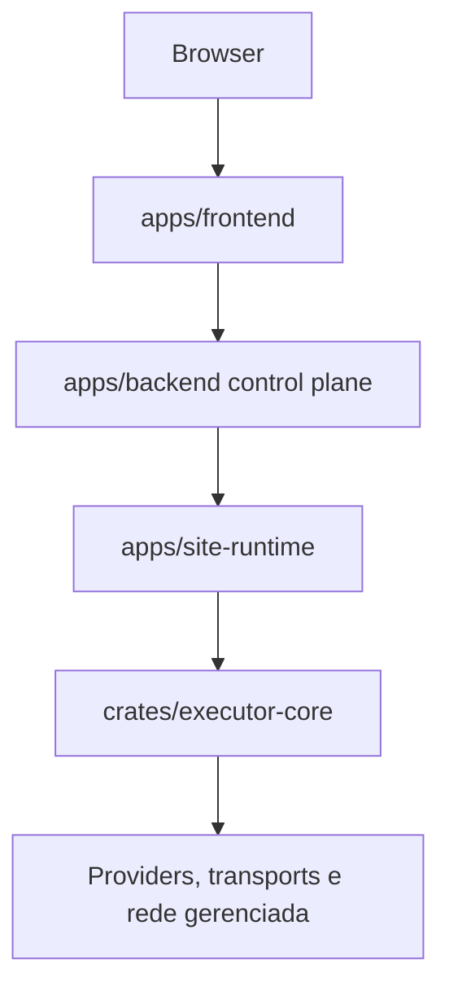

# Seven Network Manager

Plataforma de gerenciamento de infraestrutura de rede criada e mantida por **Gabriell211**.

O Seven Network Manager centraliza inventario, discovery, IPAM, telemetria, operacoes de rede e administracao de infraestrutura sem exigir que o operador trabalhe diretamente com comandos de baixo nivel no fluxo cotidiano.

## Arquitetura

O projeto adota um control plane modular e um runtime local separado para operacoes que dependem de alcance a LAN/L2.



## Regras estruturais

- `apps/backend` concentra API, autorizacao, orchestration, estado transacional e decisoes de produto.
- `apps/site-runtime` executa operacoes que precisam alcancar a rede gerenciada e funciona sem sessao grafica.
- `crates/executor-core` contem o nucleo reutilizavel de execucao de capabilities, providers e transports.
- `apps/frontend` e a interface web e nunca executa operacoes de rede diretamente.
- PostgreSQL e a fonte transacional de verdade.
- Redis e usado apenas para estado efemero, locks, rate limiting e cache compativel com a semantica do dominio.
- Operacoes sao escopadas por `organization`, `site` e `routing_domain`.
- Endereco IP nao e identidade global de dispositivo.
- Mudancas administrativas devem ser auditaveis, idempotentes quando aplicavel e explicitamente autorizadas.

## Estrutura do monorepo

```text
apps/
  backend/          API/control plane Rust Axum
  frontend/         interface Next.js
  site-runtime/     runtime local Rust headless
crates/
  domain/           tipos e invariantes de dominio
  executor-core/    execucao de capabilities/providers/transports
  shared/           contratos compartilhados de API/erro
docs/
  adr/              decisoes arquiteturais
  api/              contrato OpenAPI inicial
  product/          trial, release e validacao comercial
migrations/         migrations PostgreSQL
packages/
  ui/               componentes compartilhados do frontend
scripts/            validacoes do repositorio
```

## Issues atendidas nesta base

- #2 arquitetura modular, bounded contexts e ADR.
- #3 monorepo, boundaries e workspace.
- #4 Docker, networking e datastores.
- #5 backend Rust/Axum.
- #6 frontend Next.js self-hostable.
- #7 schema PostgreSQL inicial.
- #8 contrato REST, envelope de API e erro tipado.
- #9 framework de capabilities/providers/transports/connectivity.
- #89 routing domains/VRFs e identidade L3.
- #117 executor core Rust headless/runtime local.
- #119 trial controlado para testes, pilotos e validacao comercial.

## Desenvolvimento

```bash
cp .env.example .env
docker compose up -d postgres redis
```

Backend:

```bash
cargo run -p snm-backend
```

Runtime local:

```bash
cargo run -p snm-site-runtime
```

Frontend:

```bash
corepack enable
pnpm install --frozen-lockfile
pnpm --filter @seven-network-manager/frontend dev
```

Validacao leve do roadmap:

```bash
pnpm validate:roadmap
```

## Trial

O trial controlado esta documentado em `docs/product/trial.md` e rastreado na issue #119. Ele existe para testar o produto em cliente piloto com limite, expiracao, auditoria e caminho de conversao comercial, sem contornar RBAC, audit, vault, approval ou release gates.
