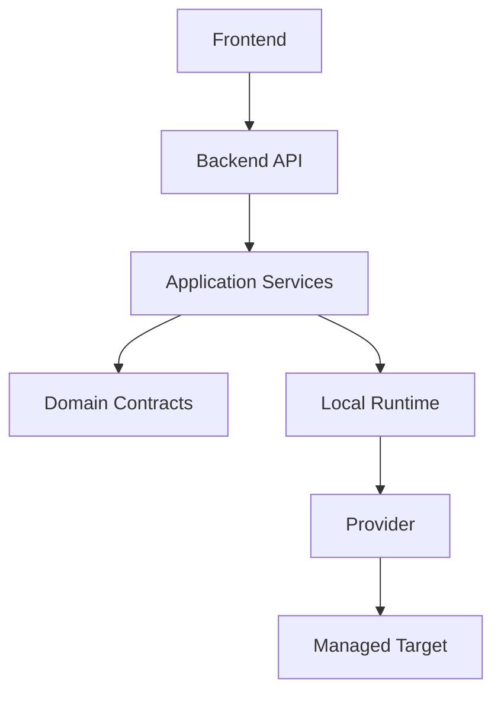

# Architecture

Seven Network Manager uses a modular monolith control plane plus a separate local headless runtime.

## Boundaries

| Boundary | Responsibility | Must Not Do |
| --- | --- | --- |
| `apps/frontend` | Operator UI, dashboard and status surfaces | Execute network capabilities directly |
| `apps/backend` | API, auth, RBAC, orchestration, persistence and product decisions | Import provider CLI/SDK details into handlers |
| `apps/site-runtime` | Headless process with LAN reachability | Own product policy or user session state |
| `crates/domain` | Domain types, invariants and capability contracts | Depend on infrastructure drivers |
| `crates/executor-core` | Runtime execution model, request/result contracts and provider dispatch | Expose unrestricted shell execution |

## Placement Rule

Placement is part of correctness. A capability that requires LAN, L2 adjacency or local routing context must run in the local runtime. The browser never becomes a network probe.

## Foundation Flow

## Data Rule

PostgreSQL is the transactional source of truth. Redis is ephemeral coordination/cache. Trial, audit, inventory, routing domains and idempotent mutations belong to PostgreSQL.
